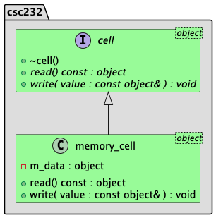

# LAB02 - C++ Classes

C++ classes are like blueprints for creating objects. A class declaration declare the data members and member functions that define the attributes and behaviors of an object. Template classes allow for data members and member functions to work with any data type, making for generic, reusable code.

## Background

Before proceeding with this lab, the student should take the time to read

* Appendix A Review of C++ Fundamentals
* Appendix F The Unified Modeling Language
* Chapter 1 Data Abstraction: The Walls
* C++ Interlude 1 C++ Classes

In this lab, the student will implement the following simple inheritance hierarchy:



**Figure 1**: UML class diagram for the `cell` class hierarchy.

Understanding the UML class diagram:

* We see two classes encapsulated within a **namespace** named `csc232` named `cell` and `memory_cell`. A namespace is nothing more than a convenient packaging mechanism that helps to disambiguate between common type names that may clash if found in dependent packages.
* One of the classes (`cell`) has an `I` icon indicating that this represents an **interface**. Technically speaking, C++ does not natively support the notion of an interface. Rather, we use an abstract base class. Nonetheless, this class _conceptually_ is treated as an interface we implement. Such a class is also known as an **abstract base class**.
* The other class (`memory_cell`) has a `C` icon indicating that this represents a **class**. This **derived class** is promising to _implement_ the methods inherited from the **base class**.
* The line connecting these classes indicates an **inheritance** relationship. The arrow points _from_ the derived class _to_ the base class.
* Any member function written in _italics_ is an abstract method. For our purposes, we shall take this to mean it is to be declared as a **pure virtual** member function.
* The upper right-hand corner of each class contains a **template parameter** that indicates these are actually template classes; the template parameter is merely a placeholder for an actual type to be chosen when declaring instances of these classes. As such, these names are defined by the programmer. We will typically use `Object`; the textbook often uses `ItemType`. Again, this is a user-defined identifier, and the name could be as simple as `T` (another typical convention, presumably suggesting the name "Type")

## Objective

Upon successful completion of this lab, the student has learned how to

* define an abstract base class to serve as an interface to be implemented
* define classes that implement an interface
* separate specifications from their implementations via header (`*.h`) and source files (`*.cpp`)

## Getting Started

After accepting this assignment with the provided GitHub Classroom Assignment link, decide how you want to work with
your newly created repository:

* Using Codespaces directly in your web browser that employees the Visual Studio Code online IDE, or
* Using the IDE of your choice on your local machine

See [setup](setup.md) for more details around setting up your development environment once you've cloned your
assignment.

## Tasks

This assignment consists of the following tasks:

* Task 1: Define the cell interface (abstract base class)
* Task 2: Define the memory cell (derived class specification)
* Task 3: Define the memory cell (derived class implementation)

Again, before you get started on these tasks, make sure you have created, and are currently working in, a branch named `develop`. If you have not created and checked out this branch yet, you must do so now! You can do this from the command-line terminal window, if you wish, using the following `git` command:

### Task 1: Define the cell interface (abstract base class)

Enumerated below are the essential steps to completing this task.

Note: Except for the first step, all work for this task takes place in the [include/cell.h](include/cell.h) header file.

1. Open the [include/csc232.h](include/csc232.h) header file and locate the `// TODO: Task 1 - Step 1:` comment and toggle the value of the `TEST_TASK1` macro from `FALSE` to `TRUE`.
2. Open the [include/cell.h](include/cell.h) and locate the `//TODO: Task 1 - Step 2` comment. Using **Figure 1** as your guide, define the `csc232::cell<Object>` default destructor. Be sure to _document_ this definition using appropriate **Doxygen** comments.
3. Next locate the `// TODO: Task 1 - Step 3` comment. Declare the **pure virtual** function `read()` accessor method as prescribed by the UML class diagram in Figure 1. Be sure to _document_ this declaration using appropriate **Doxygen** comments.

   Hint: For a value returning member function like a field accessor, the modern way to declare such method is as follows (assuming the accessor method is named `foo` and it returns a value of type  `bar`):

   ```c++
   virtual auto foo( ) const -> bar = 0;
   ```

   The keyword `virtual` makes this a **virtual member function declaration**. The `= 0` makes this a **pure virtual** declaration. We use `auto` as the return type and provide the actual return type using a `trailing type declaration` as shown by `-> bar`.
4. Continue your definition by locating the `// TODO: Task 1 - Step 4` comment. Declare the pure virtual function `write()` mutator method as prescribed by the UML class diagram in Figure 1. Since this mutator method is also a `void` method (i.e., it does not return a value), it need not be declared using `auto` along with the trailing type declaration. Again, be sure to _document_ this declaration using appropriate **Doxygen** comments.
5. Verify your work by executing the `unit_tests` target. When you are satisfied with the results of the unit tests, be sure to **stage**, **commit**, and **push** your changes to GitHub.

### Task 2: Define the memory cell (derived class specification)

Enumerated below are the essential steps to completing this task.

Note: Except for the first step, all work for this task takes place in the [include/memory_cell.h](include/memory_cell.h) header file.

1. Open the [include/csc232.h](include/csc232.h) header file and locate the `// TODO: Task 2 - Step 1:` comment and toggle the value of the `TEST_TASK2` macro from `FALSE` to `TRUE`.
2. Open the [include/memory_cell.h](include/memory_cell.h) header file and locate the `// TODO: Task 2 - Step 2:` comment. Using **Figure 1** as your guide, declare the `csc232::memory_cell<Object>` default constructor. Be sure to _document_ this declaration using appropriate **Doxygen** comments.
3. Next, locate the `// TODO: Task 2 - Step 3:` comment. Using **Figure 1** as your guide, declare/override the `csc232::memory_cell<Object>` default destructor. Be sure to _document_ this declaration using appropriate **Doxygen** comments.
4. Next, locate the `// TODO: Task 2 - Step 4:` comment. In the space below the comment and using **Figure 1** as your guide, declare the overridden `read()` accessor method.

   Hint: For a value returning member function like a field accessor, the modern way to declare such an overridden method is as follows (assuming the overridden accessor method is named `foo` and it returns a value of type  `bar`):

   ```c++
   auto foo( ) const -> bar override;
   ```

   We use `auto` as the return type and provide the actual return type using a `trailing type declaration` as shown by `-> bar`. Finally, we end this with the `override` keyword.
5. Next, locate the `// TODO: Task 2 - Step 5:` comment. In the space below the comment and using **Figure 1** as your guide, declare the overridden `write()` mutator method. Be sure to _document_ this declaration using appropriate **Doxygen** comments.
6. Next, locate the `// TODO: Task 2 - Step 6:` comment. In the space below the comment and using **Figure 1** as your guide, declare the `private` data member used to store the value of the memory cell accordingly.
7. Verify your work by executing the `test_task2` test target. When you are satisfied with the results of the unit tests, be sure to **stage**, **commit**, and **push** your changes to GitHub.

### Task 3: Define the memory cell (derived class implementation)

Enumerated below are the essential steps to completing this task.

1. Open the [include/csc232.h](include/csc232.h) header file and locate the `// TODO: Task 3 - Step 1:` comment and toggle the value of the `TEST_TASK3` macro from `FALSE` to `TRUE`.
2. Open the [src/main/cpp/memory_cell.cpp](src/main/cpp/memory_cell.cpp) source file and locate the `// TODO: Task 3 - Step 2:` comment. Implement the default constructor. Be sure to initialize your private data member using an **initializer list**; use the default constructor of your template parameter as the initial value. Since you have already documented this method in the header file, there is no need to repeat the documentation here.
3. Locate the `// TODO: Task 3 - Step 3:` comment. Implement the `read()` method. This method should merely return the value stored in the private data member. Again, since you have already documented this method in the header file, there is no need to repeat the documentation here.
4. Locate the `// TODO: Task 3 - Step 4:` comment. Implement the `write()` method. This member function should merely update the value stored in the private data member with the value passed to this member function. Again, since you have already documented this method in the header file, there is no need to repeat the documentation here.
5. Verify your work by executing the `test_task3` test target. When you are satisfied with the results of the unit tests, be sure to **stage**, **commit**, and **push** your changes to GitHub.

## Submission Details

Before submitting your assignment, be sure you have pushed all your changes to GitHub. If this is the first time you're
pushing your changes, the push command will look like:

```bash
git push -u origin develop
```

If you've already set up remote tracking (using the `-u origin develop` switch), then all you need to do is type

```bash
git push
```

As usual, prior to submitting your assignment on Brightspace, be sure that you have committed and pushed your final
changes to GitHub. Once your final changes have been pushed, create a pull request that seeks to merge the changes in
your `develop` branch into your `main` branch.

You can use `gh` to create this pull request right from your command-line prompt:

```bash
gh pr create --assignee "@me" --title "Some appropriate title" --body "A message to populate description, e.g., Go Bills!" --head develop --base main --reviewer msu-csc232-fa25/graders
```

An "appropriate" title is at a minimum, the name of the assignment, e.g., `LAB02` or `HW04`, etc.

Once your pull request has been created, submit the URL of your assignment _repository_ (i.e., _not_ the URL of the pull
request) as a Text Submission on Brightspace. Please note: the timestamp of the submission on Brightspace is used to
assess any late penalties if and when warranted, _not_ the date/time you create your pull request. **No exceptions will
be granted for this oversight**.

### Due Date

Your assignment submission is due by the end of the lab period.

### Grading Rubric

This assignment is worth **3 points**.

| Criteria           | Exceeds Expectations         | Meets Expectations                  | Below Expectations                  | Failure                                        |
|--------------------|------------------------------|-------------------------------------|-------------------------------------|------------------------------------------------|
| Pull Request (20%) | Submitted early, correct url | Submitted on-time; correct url      | Incorrect URL                       | No pull request was created or submitted       |
| Code Style (20%)   | Exemplary code style         | Consistent, modern coding style     | Inconsistent coding style           | No style whatsoever or no code changes present |
| Correctness^ (60%) | All unit tests pass          | At least 80% of the unit tests pass | At least 60% of the unit tests pass | Less than 50% of the unit tests pass           |

^ _The Google Test unit runner will calculate the correctness points based purely on the fraction of tests passed_.

### Late Penalty

* In the first 24-hour period following the due date, this assignment will be penalized 20%.
* In the second 24-hour period following the due date, this assignment will be penalized 40%.
* After 48 hours, the assignment will not be graded and thus earns no points.

## Disclaimer & Fair Use Statement

This repository may contain copyrighted material, the use of which may not
have been specifically authorized by the copyright owner. This material is
available in an effort to explain issues relevant to the course or to
illustrate the use and benefits of an educational tool. The material
contained in this repository is distributed without profit for research and
educational purposes. Only small portions of the original work are being
used and those could not be used to easily duplicate the original work.
