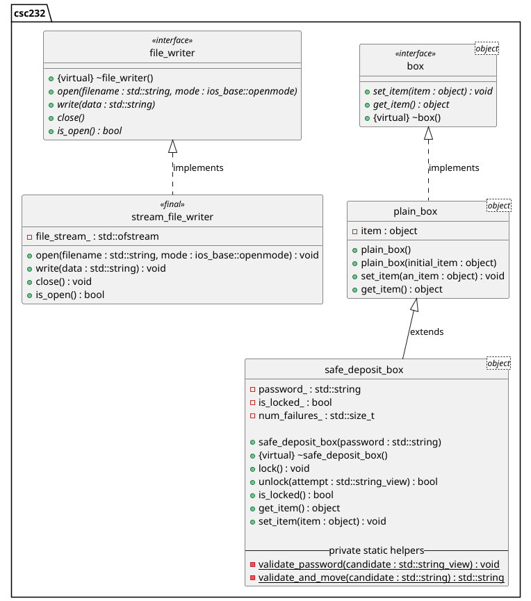

# HW01 - Extending C++ Classes

This homework assignment continues the box class hierarchy introduced in C++ Interlude 1.

## Background

Before proceeding with this lab, the student should take the time to read

* [Appendix A Review of C++ Fundamentals](https://msu.vitalsource.com/reader/books/9780138122782/epubcfi/6/574%5B%3Bvnd.vst.idref%3DP7001018341000000000000000006D88%5D!/4/2%5BP7001018341000000000000000006D88%5D/2/2%5BP7001018341000000000000000006D89%5D/7:9%5Bw%20o%2Cf%20C%5D)
* [Chapter 1 Data Abstraction: The Walls](https://msu.vitalsource.com/reader/books/9780138122782/epubcfi/6/30%5B%3Bvnd.vst.idref%3DP7001018341000000000000000000784%5D!/4/2%5BP7001018341000000000000000000784%5D/2/2%5BP7001018341000000000000000000785%5D/7:0%5B%2C%20Da%5D)
* [C++ Interlude 1 C++ Classes](https://msu.vitalsource.com/reader/books/9780138122782/epubcfi/6/46%5B%3Bvnd.vst.idref%3DP70010183410000000000000000009FA%5D!/4/2%5BP70010183410000000000000000009FA%5D/2/2%5BP70010183410000000000000000009FB%5D/7:0%5B%2C%20C%2B%5D)

## Objective

Upon successful completion of this lab, the student has learned how to

* use other libraries in developing a solution
* extend a C++ class with new behavior
* override existing inherited behavior of an ancestor class

## Getting Started

After accepting this assignment with the provided GitHub Classroom Assignment link, decide how you want to work with
your newly created repository:

* Using Codespaces directly in your web browser that employees the Visual Studio Code online IDE, or
* Using the IDE of your choice on your local machine

See [setup](setup.md) for more details around setting up your development environment once you've cloned your
assignment.

## Tasks

This assignment consists of the following tasks:

* Task 1: Define timestamp generator function
* Task 2: Define error logging function
* Task 3: Validate password
* Task 4: Define locking mechanism
* Task 5: Override inherited methods

In the end, you will provide some details behind the following class relationships.



### Task 1: Define timestamp generator function

Enumerated below are the essential steps to completing this task. For a deeper dive before you begin, see
the [Task 1 Details](task1.md) document. Also, **before you begin, be sure you have created a branch named `develop`
within which you will do your work**.

1. Open the [csc232.h](include/csc232.h) header file and locate the `TODO:  Task 1 - Step 1: Toggle TEST_TASK_1 TO TRUE`
   comment and update the macro definition as instructed. Remove the `TODO` comment once done.
2. Still in the `csc232.h` header file, locate the `TODO: Task 1` and implement this function accordingly. See
   the [Task 1 Details](task1.md) document for appropriate details and guidance.
3. When you're ready to test your solution, execute the `unit_tests` target to assess the correctness of your solution.
4. When you are satisfied with the results of the unit tests for this task, stage, commit, and push your changes to
   GitHub.

### Task 2: Define error logging function

Enumerated below are the essential steps to completing this task. For a deeper dive before you begin, see
the [Task 2 Details](task2.md) document.

1. Still in the [csc232.h](include/csc232.h) header file, locate the
   `TODO:  Task 2 - Step 1: Toggle TEST_TASK_2 TO TRUE`
   comment and update the macro definition as instructed. Remove the `TODO` comment once done.
2. Still in the `csc232.h` header file, locate the `TODO: Task 2` and implement this function accordingly. See
   the [Task 2 Details](task2.md) document for appropriate details and guidance.
3. When you're ready to test your solution, execute the `unit_tests` target to assess the correctness of your solution.
4. When you are satisfied with the results of the unit tests for this task, stage, commit, and push your changes to
   GitHub.

### Task 3: Validate password

Enumerated below are the essential steps to completing this task. For a deeper dive before you begin, see
the [Task 3 Details](task3.md) document.

1. Open the [safe_deposit_box.cpp](src/main/cpp/safe_deposit_box.cpp) source file and locate the
   `TODO:  Task 3 - Step 1: Toggle TEST_TASK_3 TO TRUE` comment and update the macro definition as instructed. Remove
   the `TODO` comment once done.
2. Still in the `safe_deposit_box.cpp` source file, locate the `TODO: Task 3` and implement this member function
   accordingly. See the [Task 3 Details](task3.md) document for appropriate details and guidance.
3. When you're ready to test your solution, execute the `unit_tests` target to assess the correctness of your solution.
4. When you are satisfied with the results of the unit tests for this task, stage, commit, and push your changes to
   GitHub.

### Task 4: Define locking mechanism

Enumerated below are the essential steps to completing this task. For a deeper dive before you begin, see
the [Task 4 Details](task4.md) document.

1. Still in the [safe_deposit_box.cpp](src/main/cpp/safe_deposit_box.cpp) source file, locate the
   `TODO:  Task 4 - Step 1: Toggle TEST_TASK_4 TO TRUE` comment and update the macro definition as instructed. Remove
   the `TODO` comment once done.
2. Still in the `safe_deposit_box.cpp` source file, locate the `TODO: Task 4a` and implement this member function
   accordingly. See the [Task 4 Details](task4.md) document for appropriate details and guidance.
3. Next, locate the `TODO: Task 4b` and implement this member function
   accordingly. See the [Task 4 Details](task4.md) document for appropriate details and guidance.
4. Next, locate the `TODO: Task 4c` and implement this member function
   accordingly. See the [Task 4 Details](task4.md) document for appropriate details and guidance.
5. When you're ready to test your solution, execute the `unit_tests` target to assess the correctness of your solution.
6. When you are satisfied with the results of the unit tests for this task, stage, commit, and push your changes to
   GitHub.

### Task 5: Override inherited methods

Enumerated below are the essential steps to completing this task. For a deeper dive before you begin, see
the [Task 5 Details](task5.md) document.

1. Still in the [safe_deposit_box.cpp](src/main/cpp/safe_deposit_box.cpp) source file, locate the
   `TODO:  Task 5 - Step 1: Toggle TEST_TASK_5 TO TRUE` comment and update the macro definition as instructed. Remove
   the `TODO` comment once done.
2. Still in the `safe_deposit_box.cpp` source file, locate the `TODO: Task 5a` and implement this member function
   accordingly. See the [Task 5 Details](task5.md) document for appropriate details and guidance.
3. Next, locate the `TODO: Task 5b` and implement this member function
   accordingly. See the [Task 5 Details](task5.md) document for appropriate details and guidance.
4. When you're ready to test your solution, execute the `unit_tests` target to assess the correctness of your solution.
5. When you are satisfied with the results of the unit tests for this task, stage, commit, and push your changes to
   GitHub.

## Submission Details

Before submitting your assignment, be sure you have pushed all your changes to GitHub. If this is the first time you're
pushing your changes, the push command will look like:

```bash
git push -u origin develop
```

If you've already set up remote tracking (using the `-u origin develop` switch), then all you need to do is type

```bash
git push
```

As usual, prior to submitting your assignment on Brightspace, be sure that you have committed and pushed your final
changes to GitHub. Once your final changes have been pushed, create a pull request that seeks to merge the changes in
your `develop` branch into your `main` branch.

You can use `gh` to create this pull request right from your command-line prompt:

```bash
gh pr create --assignee "@me" --title "Some appropriate title" --body "A message to populate description, e.g., Go Bills!" --head develop --base main --reviewer msu-csc232-fa25/graders
```

An "appropriate" title is at a minimum, the name of the assignment, e.g., `LAB02` or `HW04`, etc.

Once your pull request has been created, submit the URL of your assignment _repository_ (i.e., _not_ the URL of the pull
request) as a Text Submission on Brightspace. Please note: the timestamp of the submission on Brightspace is used to
assess any late penalties if and when warranted, _not_ the date/time you create your pull request. **No exceptions will
be granted for this oversight**.

### Due Date

Your assignment submission is due by 11:59 PM, Monday, January 26, 2025.

### Grading Rubric

This assignment is worth **5 points**.

| Criteria           | Exceeds Expectations         | Meets Expectations                  | Below Expectations                  | Failure                                        |
|--------------------|------------------------------|-------------------------------------|-------------------------------------|------------------------------------------------|
| Pull Request (20%) | Submitted early, correct url | Submitted on-time; correct url      | Incorrect URL                       | No pull request was created or submitted       |
| Code Style (20%)   | Exemplary code style         | Consistent, modern coding style     | Inconsistent coding style           | No style whatsoever or no code changes present |
| Correctness^ (60%) | All unit tests pass          | At least 80% of the unit tests pass | At least 60% of the unit tests pass | Less than 50% of the unit tests pass           |

^ _The Google Test unit runner will calculate the correctness points based purely on the fraction of tests passed_.

### Late Penalty

* In the first 24-hour period following the due date, this assignment will be penalized 20%.
* In the second 24-hour period following the due date, this assignment will be penalized 40%.
* After 48 hours, the assignment will not be graded and thus earns no points.

## Disclaimer & Fair Use Statement

This repository may contain copyrighted material, the use of which may not
have been specifically authorized by the copyright owner. This material is
available in an effort to explain issues relevant to the course or to
illustrate the use and benefits of an educational tool. The material
contained in this repository is distributed without profit for research and
educational purposes. Only small portions of the original work are being
used and those could not be used to easily duplicate the original work.
