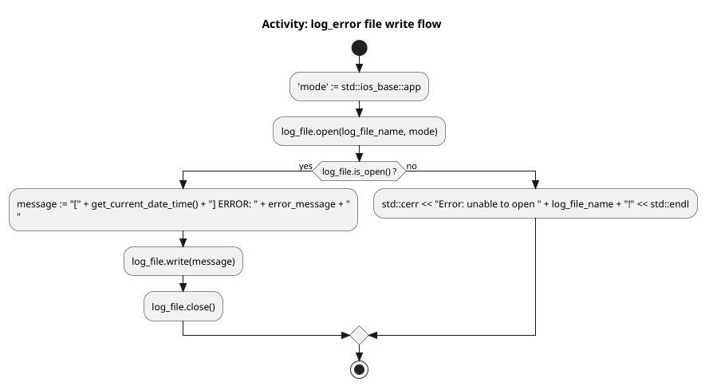

# Task 2: Define error logging function

In our second task we will implement a function we can call to log errors to a file. For example, if the `demo` target
is executed a few times (with error logging function correctly implemented), one would find the following `error.log`
file created containing the following lines:

```terminaloutput
[2026-01-19 12:49:49] ERROR: Can not open data file.
[2026-01-19 12:49:49] ERROR: Network connection timed out during API call.
[2026-01-19 12:51:57] ERROR: Can not open data file.
[2026-01-19 12:51:57] ERROR: Network connection timed out during API call.
[2026-01-19 12:52:01] ERROR: Can not open data file.
[2026-01-19 12:52:01] ERROR: Network connection timed out during API call.
[2026-01-19 12:52:47] ERROR: Can not open data file.
[2026-01-19 12:52:47] ERROR: Network connection timed out during API call.
```

The timestamps you see in the output are generated by the work done in task 1. To properly complete this task, you'll
update the following stubbed out function found in the `csc232.h` header file.

```cpp
// TODO: Task 2
inline void log_error( const std::string &log_file_name, file_writer &log_file, const std::string &error_message ) 
{
    // Erase this comment and implement me accordingly    
}
```

Firstly, let's consider the function's parameters:

* `log_file_name` - this is the name of a file that will be opened by this function
* `log_file` - this is an object that implements the `file_writer` interface
* `error_message` - this will be a message to include in the error log

The basic logic behind your implementation is captured in the following UML activity diagram:



Using this diagram, implement this logic in your function. You may also want to take a moment to understand the
`file_writer` interface which is well documented in the `file_writer.h` header file. Take note of when (and how) the
work done in task 1 is used here.

Looking again at the code in `demo.cpp`, you can see how the contents of the log file were created:

```cpp
    csc232::stream_file_writer file_writer;
    csc232::log_error( "error.log", file_writer, "Can not open data file." );
```

First an instance of `stream_file_writer` named `file_writer` (which also implements the `file_writer` interface) is
created. The name of the file (`error.log`), along with this instance, and an error message (`"Can not open data file"`)
are passed to the function.

The one last piece of information you need to successfully implement this function and complete this task is knowing the
proper mode with which to open the file. Since the activity diagram indicates we're opening and closing the file writer,
somehow when we open the file, new lines are appended to the existing file. This suggests we're opening the file in "
append" mode. We can create an object that represents this mode as follows:

```cpp
constexpr std::ios_base::openmode mode{ std::ios_base::app };
```

The object (named `mode` in this case) is passed as the second argument to the file writer's `open` method. The first
argument to this method is the name of the file to open.
