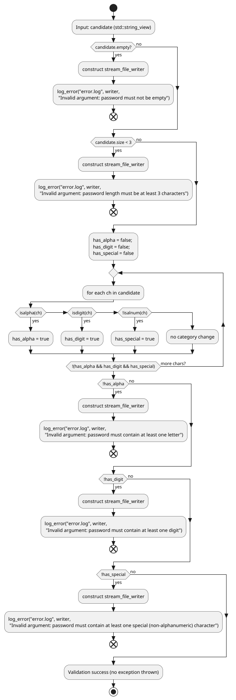

# Task 3: Validate Password

In this task, you'll be implementing the following stubbed out method of the `safe_deposit_box`:

```cpp
    // TODO: TASK 3
    template < typename object >
    void safe_deposit_box< object >::validate_password( std::string_view candidate )
    {
        // Implement me accordingly
    }
```

The following activity diagram provides the fundamental logic behind validating passwords:



This activity diagram is based upon the documentation found in the `safe_deposit_box.h` header file. It is highly
suggested you read through this thoroughly documented header file.

Looking at the method signature, you'll find this is a `void` member function. That is, it merely carries out a task (
password validation), but it does not compute/return a value. During the course of validation, if any of the checks
fail (e.g., the supplied password `candidate` is empty), the error condition is logged and an exception (
`invalid_argument`) is thrown. For example, again considering the case where an empty password `candidate` is getting
validated. Since this isn't allowed, we throw an exception with an appropriate reason why the exception is thrown.
Here's how this is done in C++:

```cpp
throw std::invalid_argument{ "password must not be empty" };
```

Whenever an exception is thrown, execution in the current scope is exited. As such, we should first log the error before
throwing the exception. Recall from the previous task, we do this by creating a `stream_file_writer` (e.g., named
`file_writer`) and then call the `log_error()` function with this file stream writer, along with a file name (e.g.,
`error.log`) and an appropriate error message.

```cpp
    stream_file_writer file_writer;
    if ( candidate.empty( ) )
    {
        log_error( "error.log", file_writer, "Invalid argument: password must not be empty" );
        throw std::invalid_argument{ "password must not be empty" };
    }
```

### Error Messages

All logged errors are to be appended to a file named `error.log` and in all cases outlined below, an `invalid_argument`
exception is thrown.

| Validation                                 | Log error message                                                                         | Exception message                                                       |
|--------------------------------------------|-------------------------------------------------------------------------------------------|-------------------------------------------------------------------------|
| password is empty                          | Invalid argument: password must not be empty                                              | password must not be empty                                              |
| password less than 3 chararacters          | Invalid argument: password length must be at least 3 characters                           | password length must be at least 3 characters                           |
| password doesn't contain alpha             | Invalid argument: password must contain at least one letter                               | password must contain at least one letter                               |
| password doesn't contain number            | Invalid argument: password must contain at least one digit                                | password must contain at least one digit                                |
| password doesn't contain special character | Invalid argument: password must contain at least one special (non-alphanumeric) character | password must contain at least one special (non-alphanumeric) character |

### Helper functions

The `safe_deposit_box.cpp` source file includes the `<cctype>` library:

```cpp
#include <cctype>
```

This library provides you access to a number of character checking functions.

| Function                  | Sample Expression                | Semantics                                           |
|---------------------------|----------------------------------|-----------------------------------------------------|
| `std::isalpha(curr_char)` | `std::isalpha( curr_char ) != 0` | the value of `curr_char` is an alphabetic character |
| `std::isdigit(curr_char)` | `std::isdigit( curr_char ) != 0` | the value of `curr_char` is a digit                 |
| `std::isalnum(curr_char)` | `std::isalnum( curr_char ) == 0` | the value of `curr_char` is a special character     |

See [Standard Library Header <cctype>](https://en.cppreference.com/w/cpp/header/cctype.html)
or [Null-terminated byte strings](https://en.cppreference.com/w/cpp/string/byte.html) for
more details on these functions and more that are found in the `cctype` library.
