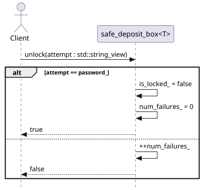

# Task 4: Define Locking Mechanism

In this task, we define a locking mechanism for the `safe_deposit_box`. This entails implementing three member functions
in the `safe_deposit_box.cpp` source file. We are given the following stubs:

```cpp
    // TODO: Task 4a
    template < typename object >
    void safe_deposit_box< object >::lock( ) noexcept
    {
        // Implement me accordingly
    }

    // TODO: Task 4b
    template < typename object >
    [[nodiscard]] auto safe_deposit_box< object >::is_locked( ) const noexcept -> bool
    {
        // Implement me accordingly
        return false;
    }

    // TODO: Task 4c
    template < typename object >
    auto safe_deposit_box< object >::unlock( const std::string_view attempt ) noexcept -> bool
    {
        // Implement me accordingly
        return false;
    }
```

## Task 4a: lock mutator method

This method is a simple mutator method. When invoked, it should merely set the `is_locked` data member to `true` and
reset the `num_failures_` data member back to 0.

## Task 4b: lock accessor method

This method is a simple accessor method. This stubbed out implementation currently returns `false`. Modify this so
that all it does is blindly return the current value stored in the `is_locked` data member.

## Task 4c: unlock the box

This method attempts to unlock the box. It checks the given candidate password against the stored password. If they
match, the box is unlocked (and the value `true` is returned indicating that the client has successfully unlocked the
box). If they don't match, the box remains locked, we increment the number of failed attempts at unlocking the box, and
we return `false`. This basic logic is presented in the following UML sequence diagram:


