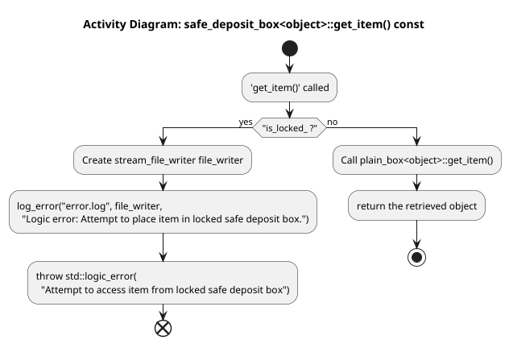
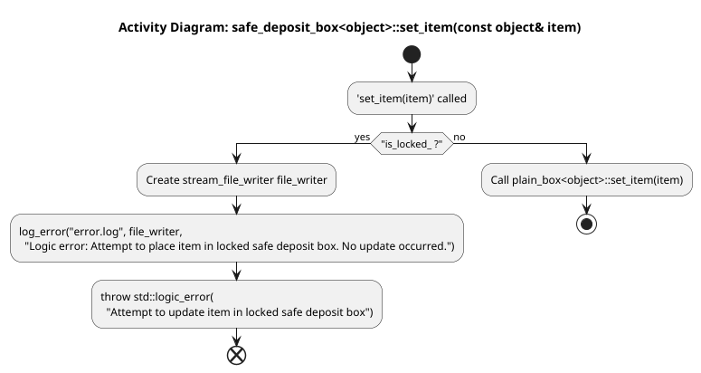

# Task 5: Override Inherited Methods

Our final task is to override the inherited `get_item` and `set_item` methods. The "issue" here that a safe deposit box
must address is whether the client has the ability to carry out these behaviors. Namely, we should not be able to get an
item from a currently locked box. Likewise, we can not place a new item in the box if it is currently locked. Below are
the stubs we're given:

```cpp
    // TODO: Task 5a
    template < typename object >
    auto safe_deposit_box< object >::get_item( ) const -> object
    {
        // Implement me accordingly
        return plain_box< object >::get_item( );
    }

    // TODO: Task 5b
    template < typename object >
    void safe_deposit_box< object >::set_item( const object &item )
    {
        // Implement me accordingly
        plain_box< object >::set_item( item );
    }
```

## Task 5a: Checking for locked condition on access

The current stubbed out implementation simply delegates to the parent class the operation of getting an item from the
box. However, before we do this, we must make sure the box isn't locked. If it is locked, we must log an error and throw
an exception. As before, error messages must be logged (appended) to a file named `error.log`. The log message in this
case should be `"Logic error: Attempt to place item in locked safe deposit box."`. The exception we throw this time is a
`std::logic_error` exception with the message `"Attempt to access item from locked safe deposit box"`. Throwing a logic
error is just like throwing an invalid argument error:

```cpp
throw std::logic_error("Error message");
```

The following activity diagram shows the suggested logic to employ in your solution.



Remember, once you throw an exception, execution leaves the current function, so be sure you log your error before you
throw your exception.

## Task 5b: Checking for locked condition on mutation

Like the accessor (`get_item( )`), the mutator (`set_item( )`) stub simply delegates to the parent class the operation
of updating an item in the box. Similarly, we must make sure the box isn't locked. If it is locked, we must log an error
and throw an exception. As before, error messages must be logged (appended) to a file named `error.log`. The log message
in this case should be `"Logic error: Attempt to place item in locked safe deposit box. No update occurred."`. The
exception we throw this time is a `std::logic_error` exception with the message
`"Attempt to update item in locked safe deposit box"`.

The following activity diagram shows the suggested logic to employ in your solution.


